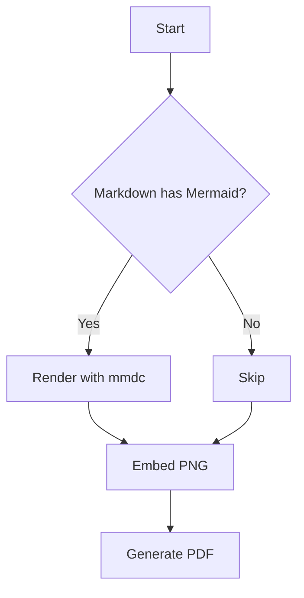
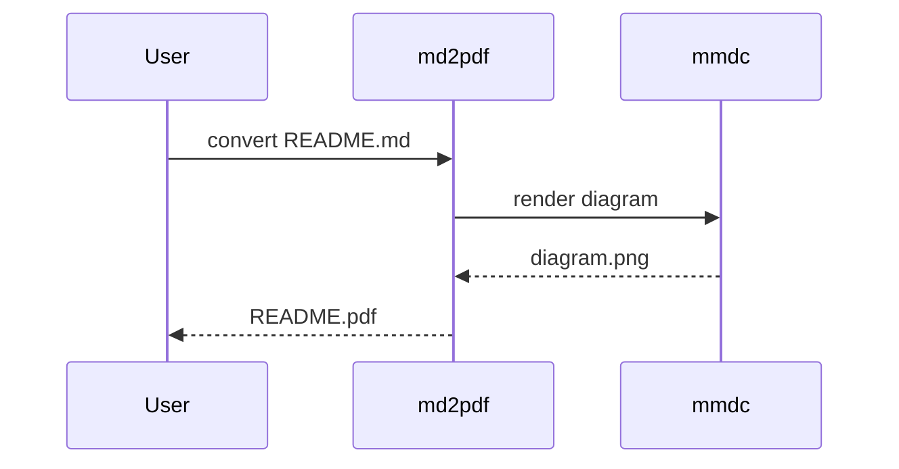

# md2pdf sample document

This document exercises the main Markdown features plus a couple of Mermaid
diagrams.

## Text formatting

Regular text with **bold**, *italic*, ~~strike-through~~ and `inline code`.
An autolink: https://github.com/mermaid-js/mermaid-cli

> A block quote to check the styling.

## A table

| Feature      | Supported |
|--------------|:---------:|
| Tables       | yes       |
| Task lists   | yes       |
| Mermaid      | yes       |

## A task list

- [x] Parse Markdown
- [x] Render Mermaid to PNG
- [ ] Conquer the world

## Flowchart



## Sequence diagram



## Code block

```java
public static void main(String[] args) {
    System.out.println("Hello, PDF!");
}
```
